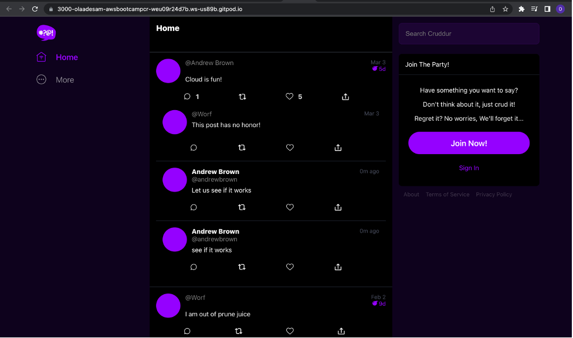

# Project - Building Cruddur application on AWS 

- Application: Cruddur

## Instructions

In this project the following will be implemented and arranged into each of the weekly journal from the link below.

Week 0 — Set-up billing on AWS and architecture design of the application
Week 1 — Containerize the App
Week 2 — Implement Distributed Tracing in the App
Week 3 — Decentralized Authentication
Week 4 — Implement Postgres and RDS
Week 5 — DynamoDB and Serverless Caching
Week 6 — Deploying “Serverless” Containers
Week 7 — Solving CORS with a Load Balancer and Custom Domain
Week 8 — Serverless Image Processing
Week 9 — CI/CD with CodePipeline, CodeBuild and CodeDeploy
Week 10 — CloudFormation Part 1
Week 11 — CloudFormation Part 2
Week 12 — Modern APIs

## Journaling Homework

The `/journal` directory contains

- [ ] [Week 0](journal/week0.md)
- [ ] [Week 1](journal/week1.md)
- [ ] [Week 2](journal/week2.md)
- [ ] [Week 3](journal/week3.md)
- [ ] [Week 4](journal/week4.md)
- [ ] [Week 5](journal/week5.md)
- [ ] [Week 6](journal/week6.md)
- [ ] [Week 7](journal/week7.md)
- [ ] [Week 8](journal/week8.md)
- [ ] [Week 9](journal/week9.md)
- [ ] [Week 10](journal/week10.md)
- [ ] [Week 11](journal/week11.md)
- [ ] [Week 12](journal/week12.md)
- [ ] [Week 13](journal/week13.md)
