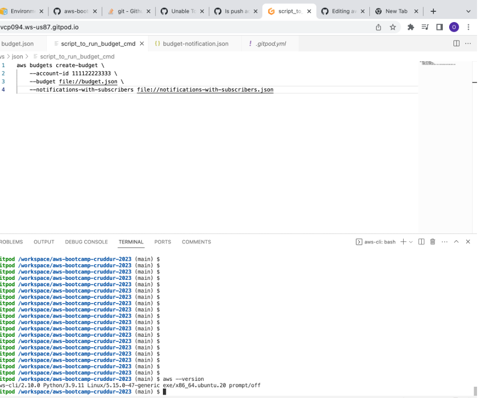
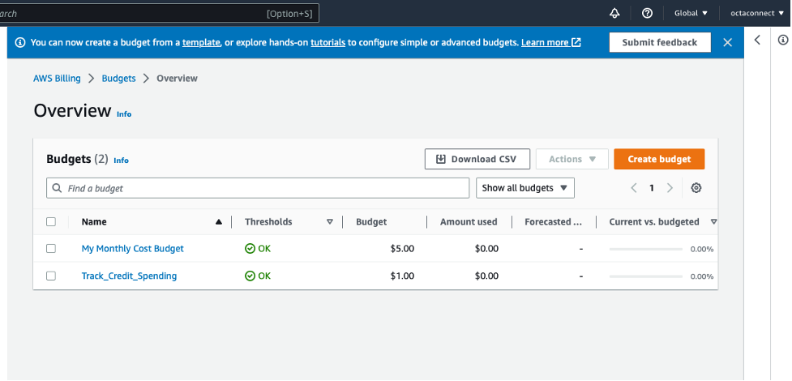
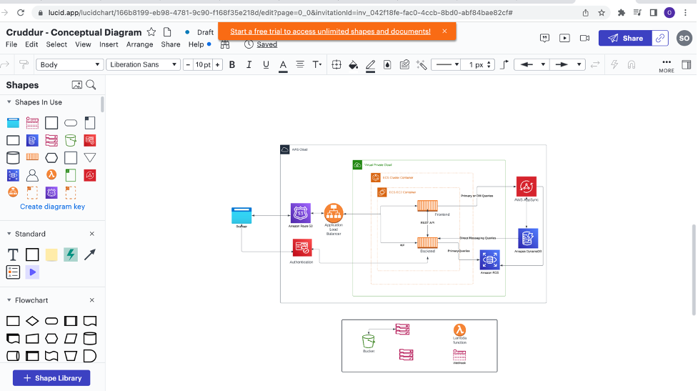
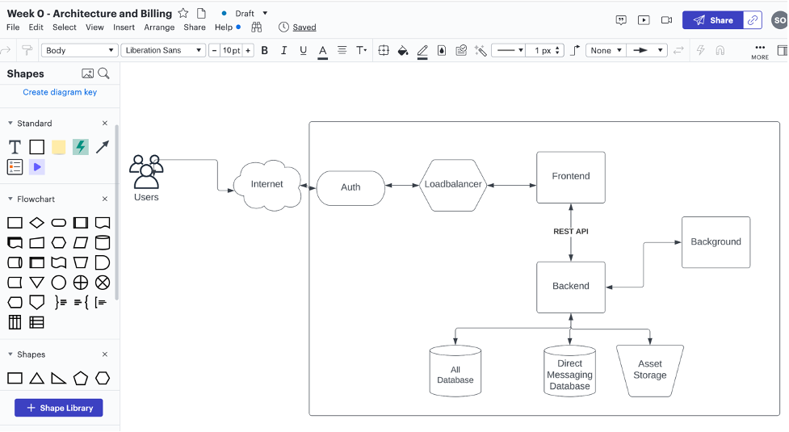
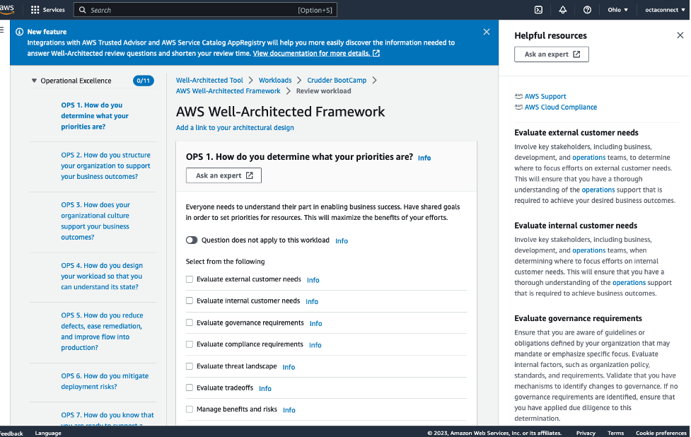
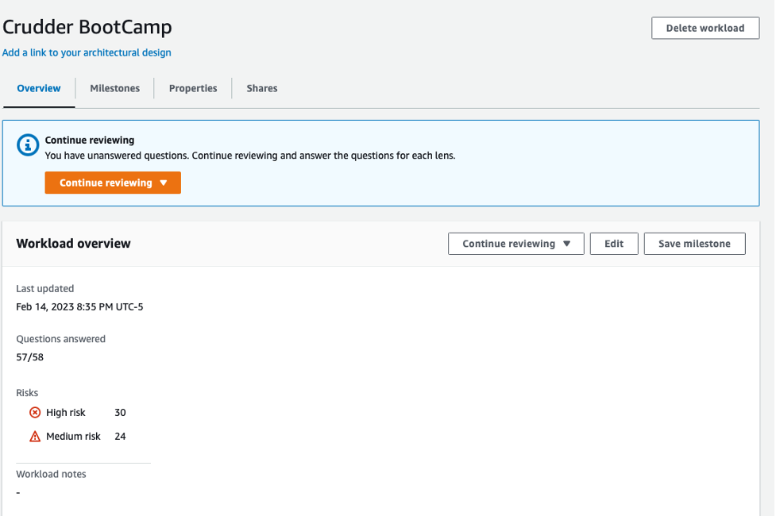
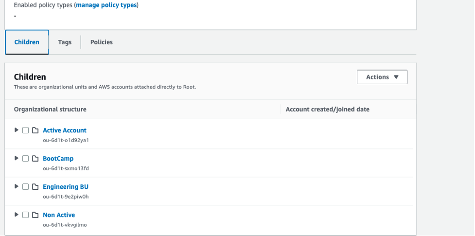

# Week 0 — Billing and Architecture

## Required Home Work Tasks

### Installing AWS CLS

I install AWS CLS using Gitpod vs workspace. I initially encounter issue when I want to push the changes
But I figure it out by granting access to Gitpod to make psuh changes to Github from the control environment of Gitpod

I went through the follow along to achieve the installation.

The codes I used for the installing

```

curl "https://awscli.amazonaws.com/awscli-exe-linux-x86_64.zip" -o "awscliv2.zip"
unzip awscliv2.zip
sudo ./aws/install

```


# Home work challenge

### Installing a Billing alarm 

I installed a billing alarm using the console. I did not use the commandline because the credential I setup on the CLI does
not have access to billing and will not be able to create alarm. 
But I pin the CLI code in my repo and I am sure it will work and also inother to protect my privacy.

# Image showing the budget and billing alarm created.



## Logical Diagram creation

I created the conceptual diagram and the logical diagram of the Cruddur app using Lucid chart
But unfortunately, I ran out of free access for the shapes . It is now requesting for payment to continue adding shape.
Because of this, I could not complete the logical diagram. 

Image for the logical diagram



Image of the conceptual diagram


Link to the LucidChart diagram
```
https://lucid.app/lucidchart/166b8199-eb98-4781-9c90-f168f35e218d/edit?page=0_0&invitationId=inv_042f18fe-fac0-4ccb-8bd0-abf84bae82cf#
```
I add two diagram in the LucidChart link, conceptual and logical

Image for the AWS Well Architecture Framework 




### AWS Organization

I was able to create organization as part of the security measure



### My homework challage for Week 0 
